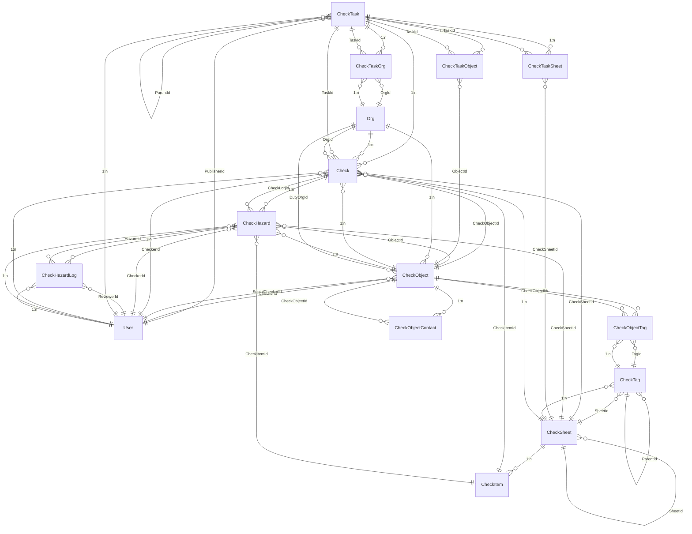
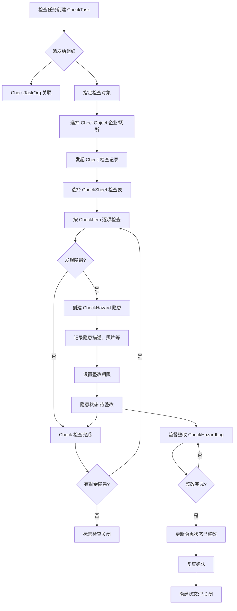
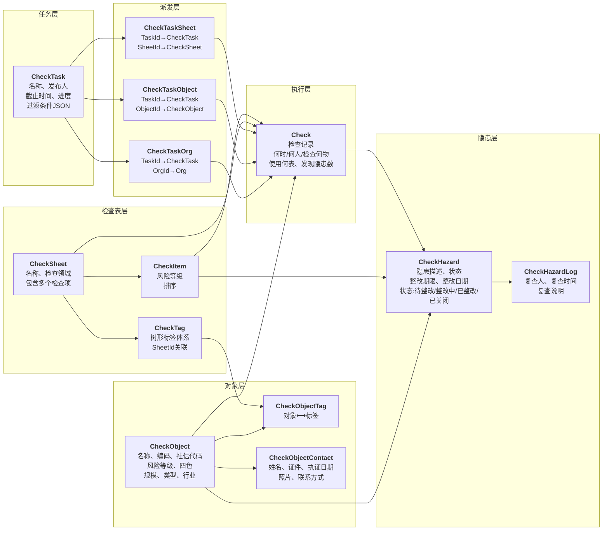

# 隐患排查（Checks）模块

## 概述

本模块实现了一套完整的隐患排查系统，支持检查任务的创建、派发、执行、隐患记录和复查全流程。包含从组织层级的任务管理，到具体企业/场所的检查执行，再到隐患的整改跟踪。

## 核心功能

- **检查任务管理**：创建、发布、派发检查任务给相关组织
- **检查对象管理**：维护待检查的企业、场所等对象及其基本信息、风险等级、人员清单
- **检查执行**：使用检查表/检查项进行现场检查，记录检查结果
- **隐患管理**：记录检查过程中发现的隐患，跟踪整改状态和复查历史
- **标签分类**：支持树形标签体系对检查对象和检查项进行分类

## 文件说明

| 文件 | 说明 |
|-----|------|
| `CheckTask.cs` | 检查任务及其关联（任务-组织、任务-对象、任务-检查表） |
| `CheckObject.cs` | 检查对象（企业/场所/机构等）的基本和风险属性 |
| `CheckSheet.cs` | 检查表和检查项定义 |
| `CheckTag.cs` | 树形标签体系 |
| `Check.cs` | 检查记录（实际执行的检查） |
| `CheckHazard.cs` | 隐患记录和隐患复查日志 |
| `CheckObjectTag.cs` | 对象与标签的多对多关联 |
| `CheckObjectContact.cs` | 检查对象的人员清单（负责人、安全管理员等） |
| `Enums.cs` | 枚举定义（风险等级、颜色、类型、规模等） |

## 核心实体

### 1. CheckTask（检查任务）
```
字段：
  - 父任务 (ParentId) - 支持任务树形关系
  - 名称、发布人、截止时间、进度
  - 过滤条件 (JSON) - 任务针对的对象过滤规则
  - 检查对象清单 - 直接指定要检查的对象IDs

关联：
  ├── n:1 Publisher (User)
  ├── 1:n Children (CheckTask)
  ├── 1:n CheckTaskOrg - 关联的处理组织
  ├── 1:n CheckTaskObject - 要检查的对象列表
  ├── 1:n CheckTaskSheet - 要使用的检查表
  └── 1:n Check - 实际检查记录
```

### 2. CheckObject（检查对象）
```
字段：
  基础：名称、编码、社会信用代码、地址、领域、建档日期
  
  风险属性：
    - 风险等级 (无/低/中/高)
    - 风险四色 (绿/黄/橙/红)
    - 业态：规模、类型、行业类型
    - 特殊标志：亿元企业、重点监管、示范企业、夜间生产等
  
  建筑属性：建筑类型、占地面积、建筑面积、房屋结构、厂房使用权
  
  人员属性：负责人、安全管理员、安全管家等
  
  数据：是否在平台录入、141系统录入状态

关联：
  ├── n:1 DutyOrg (Org)
  ├── n:1 Checker (User)
  ├── n:1 SocialChecker (User)
  ├── 1:n Tags (CheckObjectTag) - 拥有的标签
  ├── 1:n Contacts (CheckObjectContact) - 人员清单
  └── 1:n Checks - 检查记录
```

### 3. CheckSheet & CheckItem（检查表与检查项）
```
CheckSheet（检查表）：
  - 名称、领域（检查范围）
  - 1:n CheckTag - 标签分类
  - 1:n CheckItem - 检查项
  
CheckItem（检查项）：
  - 所属检查表、风险等级、名称、排序
  - 用于实际检查时选择要检查的内容
```

### 4. Check（检查记录）
```
字段：
  - 任务、检查对象、检查表、检查项
  - 检查人员、检查科室、检查时间
  - 检查结果、是否关闭
  - 隐患数、剩余隐患数（统计字段）

关联：
  ├── n:1 Task (CheckTask)
  ├── n:1 CheckObject
  ├── n:1 CheckSheet
  ├── n:1 CheckItem
  ├── n:1 Checker (User)
  ├── n:1 Org
  └── 1:n Hazards (CheckHazard)
```

### 5. CheckHazard（隐患）
```
字段：
  - 隐患描述、整改状态（待整改/整改中/已整改/已关闭）
  - 整改期限、整改日期
  - 检查项内容（冗余存储，防止删除）
  - 是否录入141

关联：
  ├── n:1 Check
  ├── n:1 CheckObject
  ├── n:1 Checker
  ├── n:1 CheckSheet
  ├── n:1 CheckItem
  └── 1:n Reviews (CheckHazardLog)
```

### 6. CheckHazardLog（隐患复查记录）
```
字段：
  - 复查人、复查时间、说明、整改状态

关联：
  ├── n:1 Hazard (CheckHazard)
  └── n:1 Reviewer (User)
```

### 7. CheckTag（标签树）
```
字段：
  - 名称、排序、所属检查表
  - 树形结构（父子关系）

关联：
  ├── n:1 Sheet (CheckSheet)
  └── 1:n ObjectTags (CheckObjectTag)
```

### 8. CheckObjectTag & CheckObjectContact
```
CheckObjectTag：连接 CheckObject 和 CheckTag（多对多）
CheckObjectContact：CheckObject 的人员清单（证件、执证日期等）
```

## 关键枚举（Enums.cs）

| 枚举 | 说明 | 值 |
|-----|------|-----|
| `CheckRiskLevel` | 风险等级 | None/Low/Medium/High |
| `CheckRiskColor` | 风险四色 | Green/Yellow/Orange/Red |
| `CheckObjectType` | 对象类型 | Place（场所）/Enterprise（企业）/Orgnization/Person/Other |
| `CheckScope` | 检查领域 | 消防安全/工矿/城市运行/道路交通/建设施工/旅游/危险化学品/其他 |
| `CheckObjectScale` | 对象规模 | SmallMicro/BelowScale/AboveScale/AboveScaleYi |
| `CheckBuildingType` | 建筑类型 | Normal/Mall/Hospital/School/Other |
| `CheckFactoryUsageType` | 厂房使用权 | 集聚区/园中园等9种类型 |
| `CheckHazardStatus` | 隐患状态 | Pending（待整改）/Rectifying/Rectified/Closed |

## 典型业务流程

1. **发布检查任务**
   ```
   创建 CheckTask → 设定过滤条件或指定对象 → 派发给 CheckTaskOrg
   ```

2. **执行检查**
   ```
   选择 CheckObject → 选择 CheckSheet → 逐项 CheckItem 检查
   → 生成 Check 记录 → 发现隐患时生成 CheckHazard
   ```

3. **跟踪隐患**
   ```
   CheckHazard（待整改） → 整改人整改 → CheckHazardLog（复查）
   → CheckHazard（已整改/已关闭）
   ```

## 使用建议

- 检查任务宜采用层级结构（如按年度-季度-月份），便于管理和统计
- CheckObject 的风险等级和四色应定期评估和更新
- 检查表应预先设计并上传，方便一线人员使用
- 隐患应设定合理的整改期限，并建立定期复查机制
- 使用标签分类对象和检查项，便于快速查询和报表统计

## 关系图

### 1. 实体关系图（ER 图）



### 2. 业务流程图



### 3. 数据分层结构




