# App.EleUI 组件说明

## 仓库结构（迁移后）

- `App.EleUI/EleUI`：控件库项目根目录（含 `App.EleUI.csproj`、`build.mjs`、`package.json`、`wwwroot/eleui`）。
- `App.EleUI/EleUISamples`：示例站项目。

`App.EleUI` 根目录只保留上述两个业务目录和本说明文件。

`App.EleUI/EleUI` 是一套基于 Razor TagHelper + Vue3 + Element Plus 的页面构建层，目标是：

- 在 Razor 页面里用声明式标签快速搭建表单、表格、布局与弹窗。
- 通过统一 JavaScript 运行时（`EleUIJs`）处理挂载、弹窗通信、表单提交等逻辑。
- 保持服务端 PageModel 与前端交互约定一致。

## 目录结构

- `Columns/`: 表格列扩展（操作列、图标列、序号列、图片列等）
- `Containers/`: 容器类组件（`EleContainer`、`EleCard`、`EleSplitPanel`）
- `Controls/`: 表单与基础控件（`EleInput`、`EleSelect`、`EleLabel` 等）
- `Layouts/`: 纯布局组件（`Row`/`Column`/`Grid`）
- `Popups/`: 弹层组件（`EleDialog`、`EleDrawer`、`ElePopover`）
- `EleUIJs/`: 前端运行时与构建器（`EleForm`、`EleTable`、`EleManager`）

## 关键基类职责

- `EleControlTagHelper`: 所有可视控件基础能力
  - 公共属性：`Width`、`Height`、`Radius`、`Border`、`BorderColor`、`Rounded`、`Shadow`、`Enabled`
  - 通用能力：权限检查、`v-model`/`:disabled` 注入、基础 style 组装
- `EleFormControlTagHelper`: 表单字段基础能力
  - `For`、`Label`、`FillRow`、`Required`、自动从模型推导标签和字段绑定
- `EleItemTagHelper`: 面向布局容器的 Tailwind 工具类封装
  - `W/H/MinW/MaxW/MinH/MaxH`、`P/Px/Py`、`M/Mx/My`、`Bg`、`Overflow`
  - 通过 `ComposeClass(...)` 统一拼装 class

## 控件清单

- 核心
  - `EleApp`
  - `EleForm`
  - `EleTable`
  - `EleManager`
- Controls
  - `EleButton`
  - `EleInput`
  - `EleNumber`
  - `EleDatePicker`
  - `EleSelect`
  - `EleTreeSelect`
  - `EleRadio`
  - `EleSwitch`
  - `EleHidden`
  - `EleLabel`
  - `EleIcon`
  - `EleImageUpload`
  - `EleSelector`
  - `EleIconSelector`
- Containers
  - `EleContainer`
  - `EleCard`
  - `EleSplitPanel`
- Layouts
  - `Row`
  - `Column`
  - `Grid`
- Popups
  - `EleDialog`
  - `EleDrawer`
  - `ElePopover`
  - `ElePopconfirm`
  - `EleTooltip`
- Columns
  - `EleColumn`
  - `EleColumns`
  - `EleOpColumn`
  - `EleNumColumn`
  - `EleIconColumn`
  - `EleImageColumn`

## 前端运行时文件（EleUIJs）

- `EleUI.js`: 总入口（导出并初始化运行时）
- `EleAppBuilder.js`: Vue 应用通用挂载器
- `EleFormAppBuilder.js`: 表单页挂载器
- `EleTableAppBuilder.js`: 表格页挂载器
- `EleForm.js`: 表单行为（加载、保存、选择器弹窗、上传等）
- `EleTable.js`: 表格行为（查询、分页、打开编辑抽屉等）
- `EleManager.js`: 全局交互（消息、确认框、抽屉、统一关闭协议）
- `DrawerHelper.js`: 抽屉生命周期与跨 iframe 关闭协议处理
- `Utils.js`: 通用工具
- `EleFixes.css`: 一些运行时样式修正

## 命名与约定

- 带弹窗选择语义的控件统一使用 `XXXSelector` 后缀。
  - 例如：`EleSelector`、`EleIconSelector`
- 抽屉/iframe 关闭统一走 `EleManager.closePage(...)` 协议。
- `EleLabel` 支持 `Bold`（bool，默认 `true`）。
- `Border` 统一为字符串属性：
  - `"true" | "1" | "yes" | "on" | "border"` => `border`
  - `"false" | "0" | "no" | "off" | "none"` => 不加边框
  - 其他值 => 自动映射为 `border-xxx`

## 类继承关系图

```mermaid
classDiagram
TagHelper <|-- EleControlTagHelper
EleControlTagHelper <|-- EleFormControlTagHelper
EleControlTagHelper <|-- EleItemTagHelper

EleControlTagHelper <|-- EleButtonTagHelper
EleControlTagHelper <|-- EleTableTagHelper
EleControlTagHelper <|-- EleIconTagHelper
EleControlTagHelper <|-- EleHiddenTagHelper
EleControlTagHelper <|-- EleCardTagHelper
EleControlTagHelper <|-- EleSplitPanelTagHelper
EleControlTagHelper <|-- EleSplitPanelItemTagHelper
EleControlTagHelper <|-- EleDialogTagHelper
EleControlTagHelper <|-- EleDrawerTagHelper
EleControlTagHelper <|-- ElePopoverTagHelper
EleControlTagHelper <|-- ElePopconfirmTagHelper
EleControlTagHelper <|-- EleTooltipTagHelper

EleFormControlTagHelper <|-- EleInputTagHelper
EleFormControlTagHelper <|-- EleNumberTagHelper
EleFormControlTagHelper <|-- EleDatePickerTagHelper
EleFormControlTagHelper <|-- EleSelectTagHelper
EleFormControlTagHelper <|-- EleTreeSelectTagHelper
EleFormControlTagHelper <|-- EleRadioTagHelper
EleFormControlTagHelper <|-- EleSwitchTagHelper
EleFormControlTagHelper <|-- EleLabelTagHelper
EleFormControlTagHelper <|-- EleSelectorTagHelper
EleFormControlTagHelper <|-- EleImageUploadTagHelper
EleFormControlTagHelper <|-- EleIconSelectorTagHelper

EleItemTagHelper <|-- EleContainerTagHelper
EleItemTagHelper <|-- EleLayoutRowTagHelper
EleItemTagHelper <|-- EleLayoutColumnTagHelper
EleItemTagHelper <|-- EleLayoutGridTagHelper

TagHelper <|-- EleFormTagHelper
TagHelper <|-- EleAppTagHelper
TagHelper <|-- ToolbarTagHelper
TagHelper <|-- EleColumnsTagHelper
TagHelper <|-- EleColumnTagHelper
TagHelper <|-- EleOpColumnTagHelper
TagHelper <|-- EleNumColumnTagHelper
TagHelper <|-- EleIconColumnTagHelper
TagHelper <|-- EleImageColumnTagHelper
TagHelper <|-- EleToolbarTagHelper
TagHelper <|-- EleCardHeaderTagHelper
TagHelper <|-- EleDialogHeaderTagHelper
TagHelper <|-- EleDialogContentTagHelper
TagHelper <|-- EleDialogFooterTagHelper
TagHelper <|-- EleDrawerContentTagHelper
TagHelper <|-- EleDrawerFooterTagHelper
```



## 参考

- Element Plus: https://element-plus.org/zh-CN
- Vue 3: https://cn.vuejs.org/

## 编译

### 仅编译 App.EleUI 控件库

在仓库根目录执行：

- `dotnet build App.EleUI/EleUI/App.EleUI.csproj`

说明：

- `App.EleUI/EleUI/App.EleUI.csproj` 在 `BuildEleUiAssets` 目标里会自动执行 `npm install` 与 `npm run build`。
- 前端打包产物输出到：`App.EleUI/EleUI/wwwroot/eleui/eleui.js`。

### 编译整解决方案

- `dotnet build AppPlat.sln`

## 运行测试项目

如需运行 EleUI 示例站（非测试项目）：

- `dotnet run --project App.EleUI/EleUISamples/EleUISamples.csproj`

若端口被占用，查找占用 6060 的进程，然后kill
  ```bash
    lsof -iTCP:6070 -sTCP:LISTEN
    kill -9 <pid>
  ```

## 发布 NuGet

### 1) 打包

- `dotnet pack App.EleUI/EleUI/App.EleUI.csproj -c Release -o ./nupkgs`

### 2) 推送到 NuGet.org

- `dotnet nuget push ./nupkgs/App.EleUI.*.nupkg --source https://api.nuget.org/v3/index.json --api-key <YOUR_API_KEY> --skip-duplicate`

建议将 API Key 通过环境变量传入，不要写进脚本。


