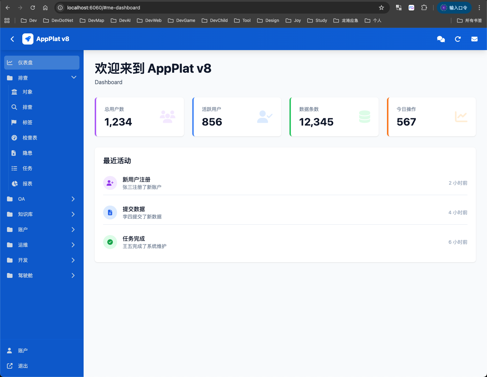
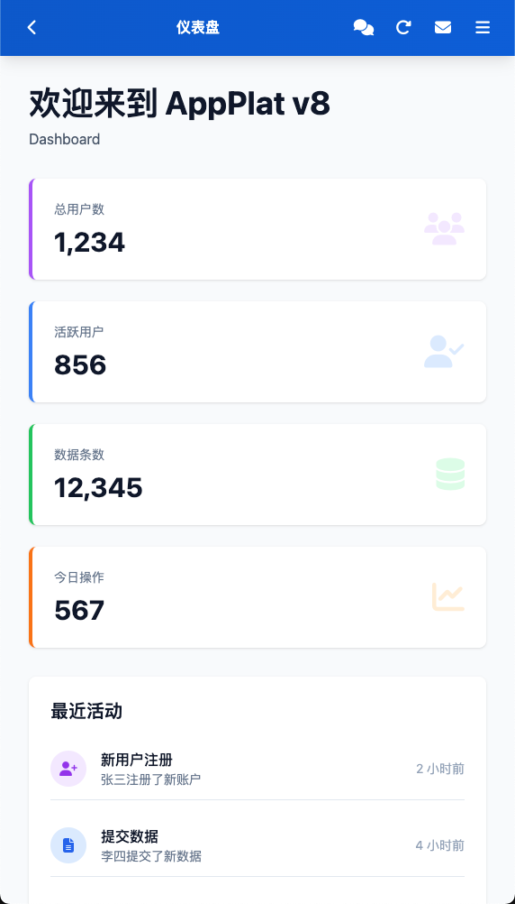

# AppPlat8

该系统是一个基于 .NET 8.0 的低代码 Web 应用开发平台，提供了以下功能：

- 用户管理：用户、角色、权限、组等。
- 运维：日志、菜单、在线等。
- OA：文章、资产、预算、项目、交办任务等。
- 驾驶舱：地图、图层、企业、区域、面板等。
- 隐患管理：对象、隐患、排查、任务、报表等。

内置以下开源方案

- UI 组件：基于 Element Plus 、VUE3、tailwindcss 构建的 UI 组件库。代码精简。
- Entities：基于EntityFramework 的数据实体 OR Mapping 方案。代码精简。
- HttpApi服务：提供 API 服务，用于前端调用，内置权限、异常、日志、文档、测试页面等功能；
- 工作流引擎： 基于 App.LiteFlow 的工作流引擎的低代码工作流管理系统。

作者

- 作者: https://github.com/surfsky
- 项目网址：https://github.com/surfsky/AppPlat8
- License: MIT





## 快速开始

1. 确保已安装 .NET 8 SDK。
2. 在 `appsettings.json` 中配置数据库连接。
3. 运行应用程序:
   ```bash
    # 编译
    cd AppPlat
    dotnet build

    # 运行项目
    dotnet run --project App

    # 或直接运行bin目录下的 dll 文件
    dotnet app.dll --urls=http://localhost:6060;http://abc.org

    # 关闭
    Ctrl+C
   ```
4.打开浏览器，访问 `http://localhost:6060` 或 `http://abc.org`。


其它

1.运行 `dotnet ef migrations add CheckObjectEvent --project App/App.csproj --startup-project App/App.csproj` 创建数据库迁移。

2.若端口被占用，查找占用 6060 的进程，然后kill
  ```bash
    lsof -iTCP:6060 -sTCP:LISTEN
    kill -9 <pid>
  ```
3. 测试项目
  ```bash
  dotnet test App.UtilsTests/App.UtilsTests.csproj
  ```


## 部署

文件部署方式

- 将/App目录下的所有文件复制到部署目录下。
- 配置数据库连接字符串：在部署目录下的 `appsettings.json` 文件中配置数据库连接字符串。
- dotnet app.dll --urls=http://localhost:6060;http://abc.org

Docker 部署方式

- 应用程序目录：
- 数据库文件映射：
- 临时文件映射：


## 数据备份

数据库备份：

- sqlite 数据库备份：直接拷贝一份到别地方就行
- postgresql 数据库备份：用 pg_dump 命令备份，用 pgagent 配置定时任务备份
- mysql 数据库备份：用 mysqldump 命令备份，用 mysqlbackup 配置定时任务备份

用户上传的文件备份：

- /App/Files/


## 进度

- [x] 基础框架
    - [x] 登陆退出
    - [x] 响应式管理后台页面布局
    - [x] 权限：角色、用户、菜单
    - [x] 菜单：动态加载、权限控制
    - [x] 修改密码
    - [x] 账户
    - [x] 关于
    - [x] API 框架：HttpApi
- [x] 账户
    - [x] 组织
    - [x] 用户
    - [x] 角色权限
- [x] 运维
    - [x] 菜单: 展示、修改
    - [x] 站点配置
    - [x] 日志
- [x] OA
    - [x] 资产：清单、详情、资产类别
    - [x] 预算：清单、详情、预算类别、预算跟踪（尚未实现）
    - [x] 公告：契丹、详情、展示页面（尚未实现）
    - [x] 公司：清单、详情
- [x] 交办
    - [x] 交办：清单、详情、进度跟踪（尚未实现）
    - [x] 事件：清单、详情
    - [x] 项目：清单、详情、进度跟踪（尚未实现）
- [ ] 知识库
    - [ ] 文档: 清单、详情、附件（尚未实现）、评论（尚未实现）
    - [x] 目录: 清单、详情
- [ ] 平台框架
    - [x] 图标
    - [x] API
    - [ ] EleUI控件
      - [x] Form
      - [x] Table
      - [x] Control
      - [x] IconSelect
      - [x] UserSelect
      - [x] TreeSelect
      - [x] EleManager
      - [x] Panel
      - [x] CollapsPanel
      - [x] SplitPanal
      - [x] App
      - [ ] 复杂组合页面
- [ ] 欢迎页：
    - [x] 基础页面
    - [ ] 任务: 个人、部门、单位
    - [ ] 消息: 公告
- [ ] 排查
    - [x] 对象: 清单、详情、检索（尚未完整实现）
        - [x] 清单详情
        - [x] 联系人子表
        - [x] 附件子表
        - [x] 数据导入
    - [ ] 检查表：
        - [x] 标签管理
        - [x] 清单、详情
        - [x] 检查项
        - [x] 标签数据导入
        - [ ] 检查表数据导入
    - [ ] 排查
        - [x] 排查：清单、详情
        - [x] 隐患：清单、详情
        - [x] 任务：清单、详情
        - [x] 检查表：检查表、标签、检查项
        - [ ] 日常排查流程：
            - [ ] 选取一个企业、点击排查、选择检查表、显示检查项、填写检查信息、生成隐患记录、提交
            - [ ] 查看隐患记录、复查登记
        - [ ] 任务排查流程：
            - [ ] 创建任务，筛选企业、检查表、承接单位
            - [ ] 承接单位分配任务到个人
            - [ ] 个人点击任务、点击排查、填写检查信息、生成隐患记录、提交
            - [ ] 查看隐患记录、复查登记
    - [ ] 报表：
        - [ ] 定时统计引擎
        - [ ] 统计表结构设计
        - [ ] 对象报表
        - [ ] 排查报表
        - [ ] 隐患报表
        - [ ] 任务报表
        - [ ] 综合报表
- [ ] 驾驶舱
    - [ ] 驾驶舱: 
      - [x] 地图：地图图层、缩放平移、三维等
      - [ ] 面板
      - [ ] 图层树
      - [ ] 图层
      - [ ] 点位
      - [ ] 点位详情
    - [x] 区域：清单、详情、在地图上定位（尚未实现）
    - [ ] 点位：清单、详情、在地图上定位（尚未实现）
    - [ ] 面板：清单、详情、数据内容、展示方式
- [ ] 工作流
    - [x] 工作流引擎(App.LiteFlow)：或基于 Activiti 的低代码工作流管理系统
    - [ ] 工作流定义：流程设计器、流程列表、流程详情
    - [ ] 工作流实例：实例列表、实例详情、审批操作
    - [ ] 工作流组件：流程图、审批表单等
    - [ ] 后台任务(App.Scheduler)
- [ ] 部署
    - [x] 本地部署
    - [x] 内网穿透测试
    - [ ] 更换 PostgreSql
    - [ ] 服务器配置
    - [ ] Docker 部署


## 菜单

以实际运行时的菜单为准

```
｜目录｜名称    ｜网页                     ｜ 访问权限            ｜
｜---｜--------｜------------------------｜--------------------｜
排查
    对象      Checks/CheckObjects           CheckObjectView
    排查      Checks/CheckLogs              CheckLogView
    检查表    Checks/CheckSheets            CheckSheetView
    隐患      Checks/CheckHarzards          CheckHarzardView
    任务      Checks/CheckTasks             CheckTaskView
    报表      Checks/CheckReports           CheckReportView
OA
    资产      OA/Assets                     AssetView
    预算      OA/Budgets                    BudgetView
    公告      OA/Annouces                   AnnouceView
    公司      OA/Company                    CompanyView
知识库
    文档      Articles/Articles             ArticleView
    目录      Articles/ArticleDirs          ArticleView
交办
    项目      OA/Projects                   ProjectView
    交办      OA/Tasks                      TaskView
    事件      OA/Events                     EventView
驾驶舱
    驾驶舱    GIS/GisIndex                  GisIndexView
    区域      GIS/Regions                   RegionView
账户
    组织      Admins/Orgs                   OrgView
    用户      Admins/Users                  UserView
    权限      Admins/Roles                  RoleView
运维
    菜单      Maintains/Menus               MenuView
    在线      Maintains/Onlines             OnlineView
    配置      Maintains/Config              ConfigView
    日志      Maintains/Logs                LogView
开发
    图标     Dev/Icons                      Dev
    API     Dev/API                        Dev
    控件库   EleUI/Index                    Dev
修改密码     Admins/ChangePassword          Site
安全退出     Logout                         Site
登陆        Login                          Site
```


## 关于AI编程和分工

此项目基于AppPlat v4-v6框架，并大量用了AI进行辅助编程。为了最大化效率，需重新定义程序员和 AI 的分工

程序员：
    业务理解
    系统架构
    流程设计
    代码质量与安全
    边界与异常
    最终验收

AI 负责：
    模板代码
    语法细节
    重复逻辑
    样板配置
    快速初稿
    搜索 & 查 API
